<p align="center">
  
</p>

<p align="center">
  <b>Dein Bücherfink für E-Books aus der Berliner Bibliothek und dem Shop.</b><br>
  Er sieht jeden Tag nach, was auf deiner Watchlist ausleihbar oder billig geworden ist,<br>
  findet Bücher, nach denen du nie gesucht hättest — und sagt dir, ob sie zu dir passen.
</p>

<p align="center">
  <a href="#schnellstart">Schnellstart</a> ·
  <a href="#so-arbeitet-buchfink">So arbeitet Buchfink</a> ·
  <a href="#bilder">Bilder</a> ·
  <a href="docs/betrieb.md">Betrieb</a> ·
  <a href="docs/rundgang.md">Rundgang</a>
</p>

<p align="center">
  
  
  
</p>

<p align="center">
  <picture>
    <source media="(prefers-color-scheme: dark)" srcset="docs/bilder/readme/telefon-home-dunkel.webp">
    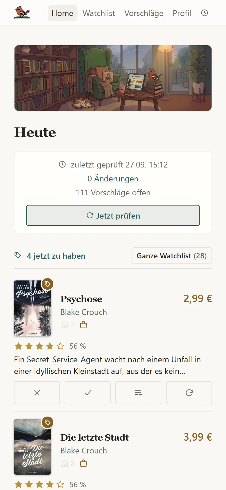
  </picture>
  <picture>
    <source media="(prefers-color-scheme: dark)" srcset="docs/bilder/readme/telefon-vorschlaege-dunkel.webp">
    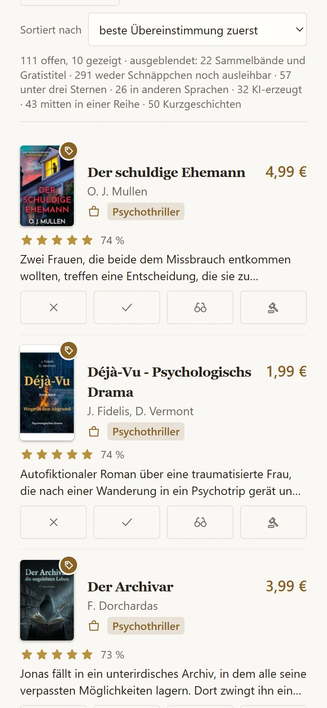
  </picture>
  <picture>
    <source media="(prefers-color-scheme: dark)" srcset="docs/bilder/readme/telefon-fund-dunkel.webp">
    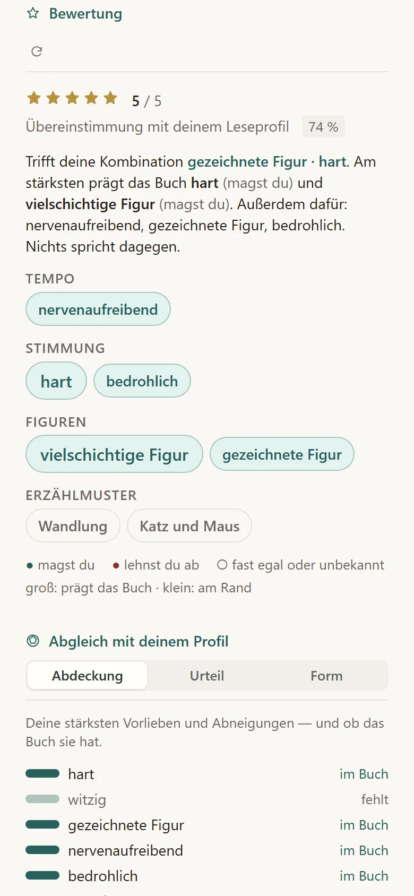
  </picture>
  <picture>
    <source media="(prefers-color-scheme: dark)" srcset="docs/bilder/readme/telefon-profil-dunkel.webp">
    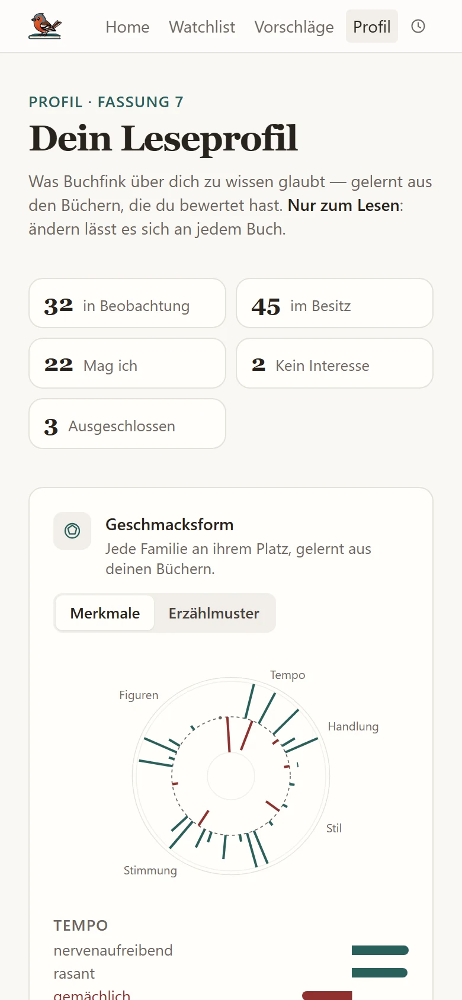
  </picture>
</p>

## Was Buchfink kann

<table>
<tr>
<td width="33%" valign="top">
<br>
<b>Eine Seite für heute</b><br>
Wann zuletzt geprüft wurde, was jetzt zu haben ist, worüber du entscheiden
solltest. Ein Tagesbericht nur dann, wenn sich etwas geändert hat.
</td>
<td width="33%" valign="top">
<br>
<b>Drei Quellen, eine Zeile</b><br>
<a href="https://voebb.onleihe.de">Onleihe</a> und
<a href="https://voebb.overdrive.com">OverDrive</a> des VÖBB, dazu
<a href="https://www.beam-shop.de">beam-shop.de</a>: Preis und
Ausleihbarkeit jedes Titels auf einen Blick.
</td>
<td width="33%" valign="top">
<br>
<b>Nur was sich lohnt</b><br>
Deine Watchlist wird zu jedem Preis gemeldet. Vorschläge müssen es sich
verdienen: als Schnäppchen, in deiner Sprache, ohne Ramsch.
</td>
</tr>
<tr>
<td valign="top">
<br>
<b>Geschmack aus deinen Büchern</b><br>
Nenn ein paar Bücher, die du geliebt hast, und ein paar, die dich enttäuscht
haben. Daraus entsteht dein Leseprofil — kein Fragebogen, kein Freitext.
</td>
<td valign="top">
<br>
<b>Jeder Stern hat einen Grund</b><br>
Ein Sprachmodell beschreibt jedes Buch einmal; wie gut es zu dir passt,
rechnet der Code — mit Begründung, die auf Merkmale zeigt.
</td>
<td valign="top">
<br>
<b>Läuft bei dir</b><br>
Kein Konto, keine Cloud: eine SQLite-Datei auf deinem Rechner oder Raspberry
Pi. Die Oberfläche passt aufs Telefon, hell wie dunkel.
</td>
</tr>
</table>

## So arbeitet Buchfink

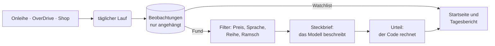

- **Ein Lauf** fragt die Quellen nach deiner Watchlist und nach Neuem von deinen
  Autor:innen, aus deinen Themen und aus Bibliothekslisten. Wer nur die
  Watchlist prüfen will, drückt „Nur Watchlist“.
- **Nichts wird überschrieben.** Jede Beobachtung wird angehängt; aussortiert
  wird erst beim Melden. Ein Buch, das heute zu teuer ist, meldet sich an dem
  Tag, an dem sein Preis fällt.
- **Das Modell beschreibt, der Code urteilt.** Der Steckbrief ordnet jedem Buch
  einmal Merkmale aus einem festen Vokabular zu. Prozent und Sterne rechnet der
  Code gegen dein Leseprofil — ändert sich das Profil, ist jede Zahl sofort
  neu. Passt ein Steckbrief nicht, beschreibt der Hammer in der Zeile das Buch
  neu.
- **Du schärfst nach, wo du liest.** Auf jeder Buchseite: „Mag ich“ oder
  „Doof“, dazu die Merkmale, auf die es dir ankommt. Jede Änderung ist eine
  neue Fassung des Profils.

## Schnellstart

Du brauchst Python 3.12 oder neuer und [uv](https://docs.astral.sh/uv/).

```bash
# 1. Holen und einrichten
git clone https://github.com/g41nxe/buchfink.git && cd buchfink
uv sync
mkdir -p data && cp examples/settings.yaml examples/seed.yaml examples/watchlist.yaml data/

# 2. Deine Titel eintragen (data/watchlist.yaml), dann in die Datenbank und ein erster Lauf
uv run python -m ebook_watchlist.run seed
uv run python -m ebook_watchlist.run

# 3. Oberfläche bauen und starten
uv run tailwindcss_install && uv run python -m ebook_watchlist.web.build
uv run python -m ebook_watchlist.web
```

Danach läuft Buchfink unter **http://localhost:8437** — vom Telefon im selben
Netz unter der Adresse deines Rechners. Der erste Lauf sammelt still; ab dem
zweiten meldet er, was sich geändert hat. Unter **Profil → Erstaufnahme
beginnen** nennst du deine Bücher, und die Vorschläge bekommen Sterne.

> [!NOTE]
> Für Sterne braucht Buchfink das Vokabular der Merkmale (`vocabulary/`), das
> wegen einer offenen Lizenzfrage nicht im Repository liegt (#59), und einen Weg
> zum Sprachmodell: eine angemeldete [Claude-Code](https://claude.com/claude-code)-Installation
> oder `ANTHROPIC_API_KEY` in der Umgebung. Ohne beides beobachtet und sammelt
> Buchfink wie beschrieben, nur ohne Urteil.

> [!WARNING]
> Die Oberfläche hat keine Anmeldung. Sie gehört ins Heimnetz, nicht ins offene
> Internet; `--host 127.0.0.1` beschränkt sie auf diesen Rechner.

## Bilder

<details>
<summary><b>Die Seiten am Desktop</b> (aufklappen)</summary>

<br>

**Das Urteil zu einem Fund** — Sterne, Begründung, Merkmale, und wo sich dein Geschmack und das Buch treffen

<picture>
  <source media="(prefers-color-scheme: dark)" srcset="docs/bilder/readme/desktop-fund-dunkel.webp">
  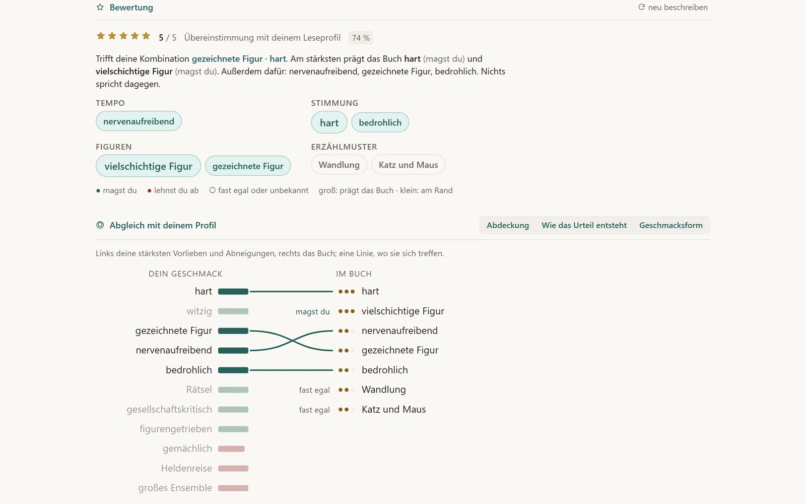
</picture>

**Vorschläge** — nach Übereinstimmung sortiert, entschieden mit einem Klick

<picture>
  <source media="(prefers-color-scheme: dark)" srcset="docs/bilder/readme/desktop-vorschlaege-dunkel.webp">
  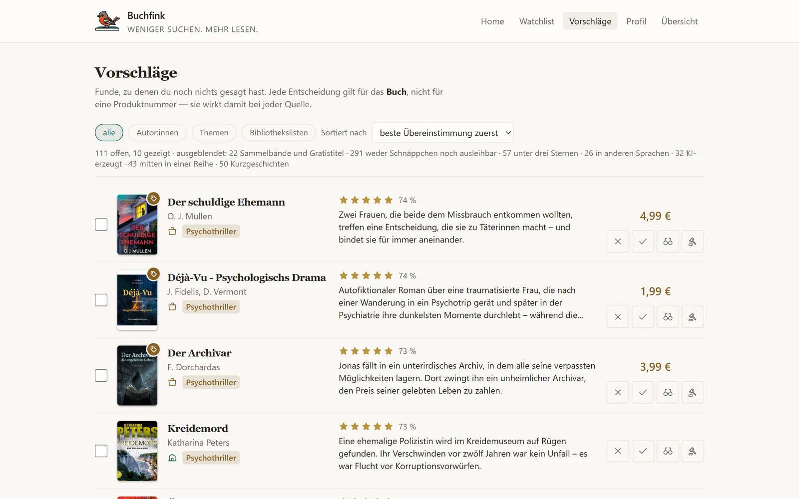
</picture>

**Watchlist** — Preis und Ausleihstatus, „Nur Watchlist“ prüft sofort nach

<picture>
  <source media="(prefers-color-scheme: dark)" srcset="docs/bilder/readme/desktop-watchlist-dunkel.webp">
  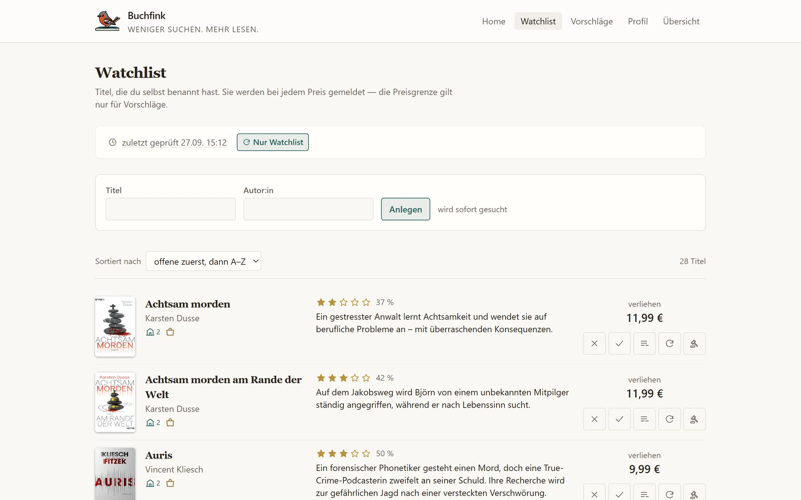
</picture>

**Leseprofil** — die Geschmacksform, gelernt aus deinen Büchern

<picture>
  <source media="(prefers-color-scheme: dark)" srcset="docs/bilder/readme/desktop-profil-dunkel.webp">
  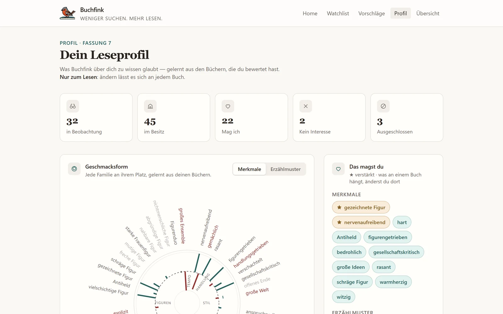
</picture>

**Buchseite** — was du dazu sagst, wo es zu haben ist

<picture>
  <source media="(prefers-color-scheme: dark)" srcset="docs/bilder/readme/desktop-buch-dunkel.webp">
  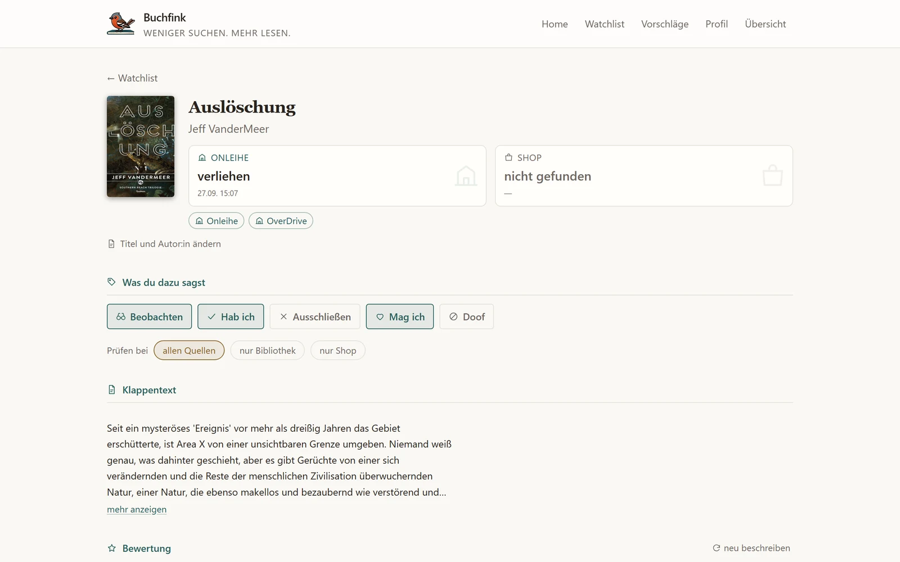
</picture>

**Startseite** — was jetzt zu haben ist

<picture>
  <source media="(prefers-color-scheme: dark)" srcset="docs/bilder/readme/desktop-home-dunkel.webp">
  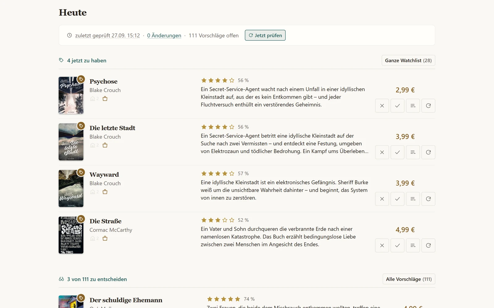
</picture>

</details>

## Befehle

Alle über `uv run python -m ebook_watchlist.run <befehl>`; dieselben Läufe stößt
auch die Oberfläche an. Eine Dateisperre sorgt dafür, dass nie zwei
gleichzeitig laufen.

| Befehl | Was er tut |
| --- | --- |
| `run` | ein vollständiger Lauf (Voreinstellung); mit `--watchlist` nur die Watchlist |
| `seed` | überführt `seed.yaml`, `watchlist.yaml` und `owned.yaml` in die Datenbank; beliebig wiederholbar |
| `doctor` | prüft nur, ob die Quellen noch gelesen werden können |
| `sources` | zeigt den Zustand der Quellen, pausiert eine mit `--disable` |
| `rate` | schreibt Steckbriefe für den Rückstand an Vorschlägen |
| `judge` | hält Titel oder eine YAML-Liste gegen dein Profil und schreibt Sterne und Begründung dazu |
| `dismissals` | löst alte Shop-Produktnummern aus `dismissed.yaml` in Buch-Beziehungen auf |

## Betrieb

Am besten ein täglicher Lauf und eine dauerhaft laufende Oberfläche. Fertige
Vorlagen für **Docker Compose** (auch hinter Traefik), die **Windows-Aufgabenplanung**
und **systemd** auf Linux oder dem Raspberry Pi stehen in
[docs/betrieb.md](docs/betrieb.md).

## Entwickeln

```bash
uv run pytest && uv run ruff check .
```

Die Suite greift nicht aufs Netz; Smoke-Tests gegen die echten Quellen laufen
nur mit `-m live`. Der Code ist englisch, alles Gelesene deutsch — die Begriffe
dazwischen stehen in [CONTEXT.md](CONTEXT.md). Ohne `vocabulary/` werden die
Tests zum Urteil übersprungen; ein anderes Verzeichnis nennt
`EBW_VOCABULARY_DIR`. Für Agenten: [CLAUDE.md](CLAUDE.md) und
[docs/agents/](docs/agents).

## Dokumentation

| | |
| --- | --- |
| [Rundgang](docs/rundgang.md) | was das Werkzeug kann und wie ein Lauf arbeitet, ohne den Code zu lesen |
| [Glossar](CONTEXT.md) | jeder englische Begriff mit seinem deutschen Wort |
| [Entscheidungen](docs/adr) | alle ADRs; zum Urteil vor allem [ADR 33](docs/adr/0033-das-leseprofil-entsteht-aus-buechern-und-der-code-urteilt.md) |
| [Bewertungsschema](docs/bewertungsschema.yaml) | Gewichte, Sternetabelle und die Schwelle für den Vorschlagsstapel |
| [Offene Punkte](docs/offene-punkte.md) | was fehlt, und welche Behauptungen sich als falsch erwiesen haben |
| [Recherche](docs/research) | Quellen, Metadaten, die [Urteilsmethode](docs/research/urteil-methode.md) und [Urteile ohne API-Schlüssel](docs/research/rating-without-an-api-key.md) |

## Lizenz

[MIT](LICENSE).
